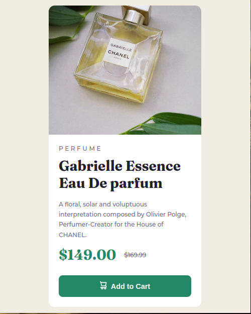

# Frontend Mentor - Product preview card component solution

This is a solution to the [Product preview card component challenge on Frontend Mentor](https://www.frontendmentor.io/challenges/product-preview-card-component-GO7UmttRfa). Frontend Mentor challenges help you improve your coding skills by building realistic projects. 

## Table of contents

- [Overview](#overview)
  - [Screenshot](#screenshot)
  - [Links](#links)
- [My process](#my-process)
  - [Built with](#built-with)
  - [What I learned](#what-i-learned)
  - [Continued development](#continued-development)
  - [Useful resources](#useful-resources)
- [Author](#author)
- [Acknowledgments](#acknowledgments)

**Note: Delete this note and update the table of contents based on what sections you keep.**

## Overview
A Frontend Mentor project that uses CSS and HTML to design a Product preview card component.

### Screenshot

### Links

- Solution URL: [Add solution URL here](https://your-solution-url.com)
- Live Site URL: [Add live site URL here](https://your-live-site-url.com)

## My process 
- It was difficult for me to align my content to the center at first, i had to watch couples of video discussing justify contents, align-items, min-max(width) and min-max(height).

### Built with

- Semantic HTML5 markup
- CSS custom properties
- Flexbox
- Mobile-first workflow
- Media Querries

### What I learned

- I was able to understand the concept of flex and its value
- I was able to understand when and why do we use justify-content, align-items, min-max(width) and also min-max(height).
- I was able to work around media querry with a beginners knowledge

### Continued development

Currently learning the basic concepts of CSS and its properties. Afterward i would be diving into javascript and also choosing React and my framework, just to build more interactive project

### Useful resources

- [Google](https://www.google.com) - This helped me for finding solution to why and when to use justify-content, align-items, width and max.

## Author

- Website - [Abubakar Sidiq](https://www.your-site.com)
- Frontend Mentor - [@ayoola32](https://www.frontendmentor.io/profile/ayoola32)
- Twitter - [@ayoola_32](https://www.twitter.com/ayoola_32)

## Acknowledgments

All praises and adoration be onto Allah for granting me this priviledge to embark on this journey and making its completion a successful one.
